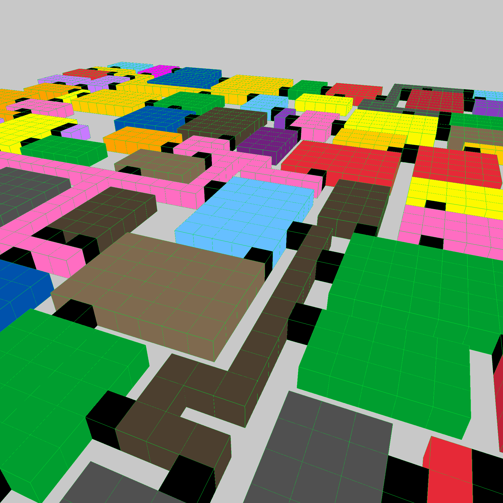

# maze
This [article](https://journal.stuffwithstuff.com/2014/12/21/rooms-and-mazes/) was implemented by zig.
screenshot:


# Run demo
You can run the demo with the following command:
```zig
zig build run
```
Control:

View: move the mouse

Move: w a s d

Up and down: q e

Generate a new maze: space


# Building and using
## In an existing project
Download and add maze as a dependency by running the following command in your project root:
```shell
zig fetch --save git+https://github.com/sdzx-1/maze.git
```

Then add maze as a dependency and import its modules and artifact in your build.zig:

```zig
    const maze_dep = b.dependency("maze", .{
        .target = target,
        .optimize = optimize,
    });

    const maze = maze_dep.module("maze");
```

Now add the modules and artifact to your target as you would normally:

```zig
    exe.root_module.addImport("maze", maze);
```

----------------------
Example code:
```zig
const std = @import("std");
const maze = @import("maze");
const Maze = maze.Maze;

pub fn main() !void {
    var gpa = std.heap.GeneralPurposeAllocator(.{}){};
    const allocator = gpa.allocator();
    var m = try Maze.init(allocator, 31, 31, 3, 7, 0.2, 1234);
    try m.genMaze(allocator);
    m.print();
}

```
Output
```shell
➜  tmp zig build run 
rooms: 22
path: 3
=============
p: 0.00, val: 0ms, key: generateRoom
p: 0.50, val: 1ms, key: floodFill
p: 0.50, val: 1ms, key: findConnPoint
p: 0.00, val: 0ms, key: generateTree
p: 0.00, val: 0ms, key: removeSing
total time: 2ms
                                                              
  x x x x x   x x x x x x x               + ? x x x   x x x   
  x x x x x   x x x x x x x               +   x x x   x x x   
  x x x x x ? x x x x x x x   + + + + + + +   x x x ? x x x   
  x x x x x   x x x x x x x   +                   ?   ?       
  x x x x x   x x x x x x x   +       x x x ? + ? x x x x x   
  x x x x x   ?               +       x x x   +   x x x x x   
  x x x x x   + + + + + + + + +       x x x ? + ? x x x x x   
          ?   ?   +           ?               +   x x x x x   
  x x x x x x x   + + + + +   x x x x x       +   x x x x x   
  x x x x x x x       ?   ?   x x x x x       +   x x x x x   
  x x x x x x x       x x x   x x x x x       +   x x x x x   
  x x x x x x x       x x x   x x x x x       +           ?   
  x x x x x x x       x x x   x x x x x ? +   +       x x x   
  x x x x x x x       ?   ?   x x x x x   +   +       x x x   
  x x x x x x x ? x x x x x   x x x x x ? + + + + +   x x x   
          ?       x x x x x       ?       ?   ?   ?   ?       
  x x x   + + +   x x x x x   x x x   x x x x x ? x x x       
  x x x       +               x x x   x x x x x   x x x       
  x x x ? + + + + + + + + +   x x x ? x x x x x   x x x       
          +               +   ?   ?   ?           ?           
  x x x ? +   x x x x x   +   x x x   + + + + + + + + + + +   
  x x x   +   x x x x x   +   x x x   +       ?           +   
  x x x   +   x x x x x   +   x x x   +   x x x x x       +   
      ?   +   x x x x x   +   x x x   +   x x x x x       ?   
  x x x   +   x x x x x   + ? x x x   + ? x x x x x   x x x   
  x x x   ?       ?   ?   +           +   x x x x x   x x x   
  x x x   x x x x x   +   +           +   x x x x x ? x x x   
  x x x   x x x x x   +   +           +   x x x x x   x x x   
  x x x   x x x x x   + + + + + + + + +   x x x x x   x x x   

```
